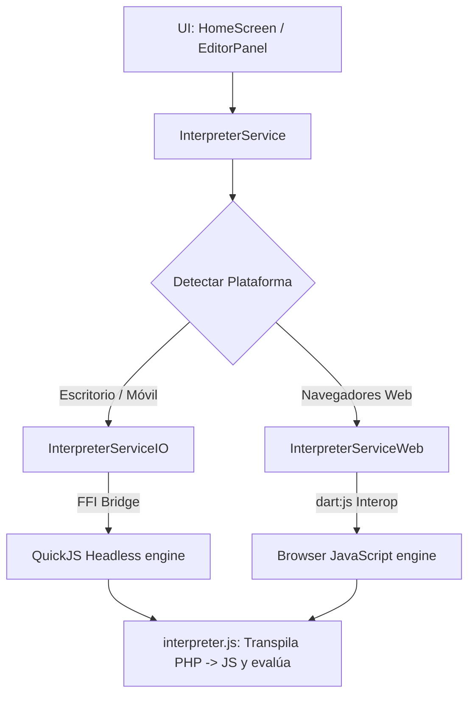

# Plan de Implementación de Alta Densidad: GravisPHPHUB 🐘📱

Inspirado directamente por la estructura pedagógica de **freeCodeCamp**, este documento detalla el plan de implementación y la arquitectura técnica de **GravisPHPHUB** (anteriormente PHPCamp). La plataforma ha sido reestructurada por completo como una aplicación nativa multiplataforma (Móvil, Escritorio y Web) utilizando **Flutter/Dart**.

---

## 🎨 Estado Actual y Hitos Completados 🏆

Hemos completado la fase completa de migración y optimización, logrando un entorno de desarrollo premium, seguro y de alto rendimiento:

1. **Migración e Inicialización Completa [100%]**: Se inicializó el proyecto Flutter con soporte nativo multiplataforma (Windows y Web) y se eliminaron por completo todos los archivos HTML/JS/CSS antiguos y redundantes para mantener el repositorio limpio.
2. **Currículo de Alta Densidad Portado [100%]**: Se migraron los **9 niveles y 31 retos interactivos** a un archivo de datos centralizado e inmutable en [challenges.json](file:///c:/DEV/GravisStudyingHUB/gravis_php_hub/assets/curriculum/challenges.json).
3. **Soporte Multiplataforma Híbrido en Sandbox [100%]**: Se resolvió la imposibilidad de compilar FFI (QuickJS) en navegadores Web mediante un motor de importaciones condicionales que conmuta de forma transparente entre QuickJS en escritorio y el motor JS nativo del navegador en la Web.
4. **Sincronización Bidireccional Supabase [100%]**: Conexión activa con el backend original del usuario para descargar progreso al iniciar/loguearse y realizar un guardado instantáneo (`upsert`) a la tabla `user_progress` cada vez que se supera un reto.
5. **Esquive de Bloqueo de Facturación GitHub [100%]**: Al estar bloqueadas las GitHub Actions de la cuenta por facturación, compilamos de forma local la versión Web optimizada y la desplegamos en la carpeta `/docs/` de la rama `main`, garantizando el funcionamiento instantáneo de GitHub Pages.

---

## 💻 Arquitectura de Ejecución en Sandbox (Multiplataforma)

Para resolver las restricciones de FFI en compilación Web, la arquitectura del motor de evaluación se dividió mediante **Importaciones Condicionales de Dart**:



### Detalle de Implementación
* **`interpreter_service_stub.dart`**: Define los modelos comunes de resultados (`PHPExecutionResult`) y la firma abstracta de los servicios.
* **`interpreter_service_io.dart`**: Importa de forma aislada `package:flutter_js` y expone el motor QuickJS embebido para sistemas Windows/macOS/Linux/Android/iOS.
* **`interpreter_service_web.dart`**: Importa `dart:js` y ejecuta el transpilador inyectándolo directamente en el objeto global `window` de la página. Corre a 100x velocidad sin sobrecargar memoria gracias al compilador JIT nativo del navegador.

---

## 🔄 Flujo de Sincronización en la Nube con Supabase

El sistema de almacenamiento del progreso interactivo está totalmente integrado con tu base de datos relacional de Supabase de la siguiente manera:

```
[Usuario supera reto] 
        │
        ▼
[Actualizar estado inmutable en Flutter (Riverpod)]
        │
        ├─► [Persistencia en Local (SharedPreferences)]
        │
        └─► [Usuario autenticado?]
                 │
                 ├──► SÍ ──► [Upsert a tabla 'user_progress' en Supabase]
                 └──► NO ──► [Mantener local hasta inicio de sesión]
```

* **Estructura de Base de Datos**: Mapeo directo sobre la tabla `user_progress` con columnas `user_id` (UUID clave primaria), `completed_challenges` (objeto JSON que almacena pares clave-valor de retos superados, ej: `{"m1_hola_mundo": true}`) y `updated_at` (Timestamp).
* **Down-Sync automático**: 
  * Al iniciar sesión mediante el formulario en la app, se llama inmediatamente a `syncProgressFromSupabase(userId)` para traer todo el historial al dispositivo local y fusionarlo con los borradores temporales.
  * Al abrir la app, si existe sesión en caché, se descarga el progreso en segundo plano para una experiencia de usuario transparente.

---

## 🏆 Estructura del Currículo de Alta Densidad ( freeCodeCamp Style )

El currículo ha sido consolidado en **9 niveles con 31 retos prácticos interactivos**:

1. **Nivel 1: Sintaxis Básica y Salidas (Retos 1-2)**: Primer hola mundo e impresión con etiquetas HTML.
2. **Nivel 2: Comentarios y Buenas Prácticas (Reto 3)**: Documentación de código y comentarios estructurados de bloque.
3. **Nivel 3: Variables y Tipado Dinámico (Retos 4-7)**: Declaración de variables, concatenación y manipulación de constantes.
4. **Nivel 4: Operadores Aritméticos y Concatenación (Retos 8-11)**: Cálculos aritméticos y unificación de cadenas de texto.
5. **Nivel 5: Lógica Condicional y Decisiones (Retos 12-16)**: Bifurcación de ejecución, comparación idéntica (`===`) y lógica booleana compuesta.
6. **Nivel 6: Estructuras de Datos - Arrays (Retos 17-21)**: Manipulación de colecciones de datos, arrays indexados clásicos y arrays asociativos con claves de cadena.
7. **Nivel 7: Bucles e Iteración (Retos 22-25)**: Control de repeticiones utilizando estructuras `for` y `foreach` simple/asociativo.
8. **Nivel 8: Funciones y Tipado Estricto (Retos 26-28)**: Reutilización estructurada de bloques de código y firmas seguras bajo PHP 8.
9. **Nivel 9: Proyectos de Integración y Casos Reales (Retos 29-31)**: Aplicación avanzada simulando integraciones con Laravel.

---

## 🚀 Despliegue de Producción Manual a GitHub Pages

Para evitar el bloqueo de facturación en las Actions de tu cuenta de GitHub, el despliegue a la web se realiza directamente desde la rama `main` en la carpeta `/docs` siguiendo este sencillo procedimiento:

### Paso 1: Compilar de forma local en tu computadora
Desde la terminal del proyecto ejecutamos:
```bash
cd gravis_php_hub
flutter build web --release --base-href "/phpcamp/"
```

### Paso 2: Mover el build a la carpeta docs del repositorio
Copia el contenido resultante en `gravis_php_hub/build/web` dentro de la carpeta `docs` en la raíz del repositorio.

### Paso 3: Subir a GitHub
```bash
git add .
git commit -m "chore: Deploy compiled production web app to docs folder"
git push
```

### Paso 4: Cambiar la ruta en GitHub Settings
En la interfaz web de GitHub:
1. Ve a **Settings** -> **Pages**.
2. Bajo **Branch**, selecciona **`main`** y cambia la carpeta de **`/(root)`** a **`/docs`**.
3. Presiona **Save**.

¡Tu sitio web cargará el IDE interactivo de Flutter de manera instantánea!
